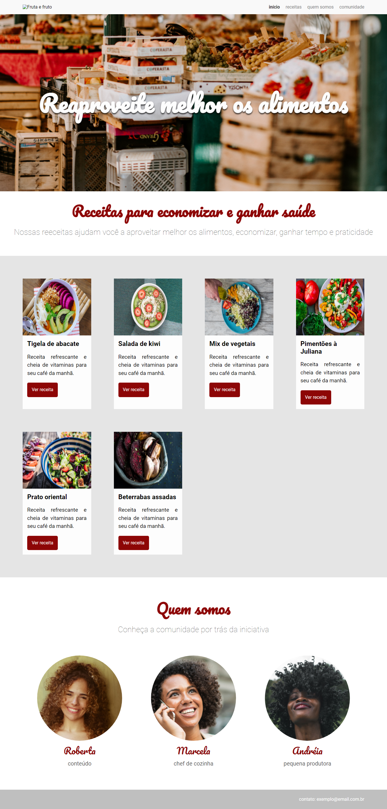
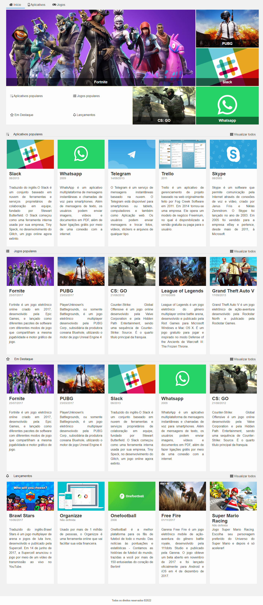
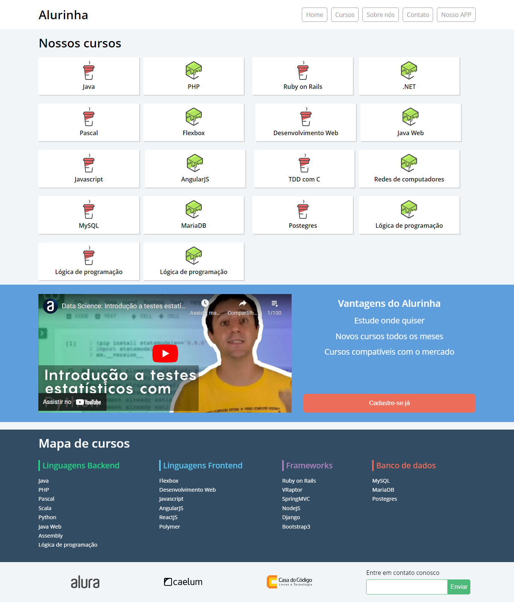
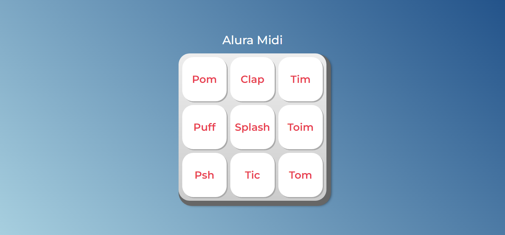

# Formação FrontEnd Alura
Repositório destinado aos exrcícios práticos presentes na formação front-end da Alura

Principais Conteúdos:

- Arquitetura CSS

- CSS Grid - Alura Store

- CSS Flexbox - Alurinha

- JS para WEB - Alura Midi

- Layouts Responsivos - Apeperia

